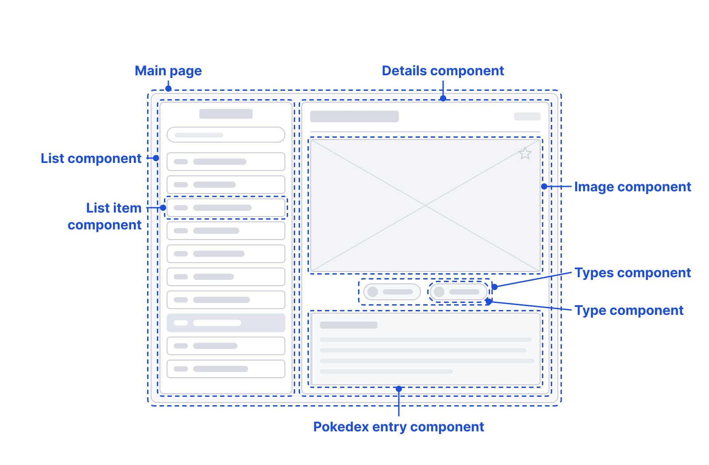
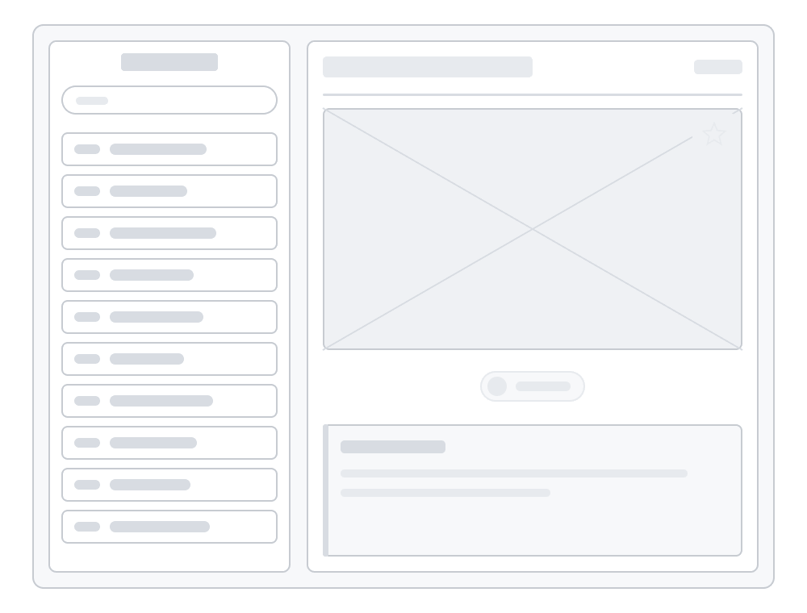

# COMPSCI 719 Assignment - A Pokédex

In this assignment, you will build a web application allowing users to browse information on different Pokémon (i.e. a "Pokédex" application).

This assignment is divided into two parts:

1. _Previously_, in Part A, you built a static page using HTML, CSS, and dummy data / images which had been provided to you. This allowed you to demonstrate your knowledge of HTML & CSS, in addition to showing off your creative flair! It gave you the opportunity to research and apply additional CSS techniques not covered in class, such as additional kinds of CSS selectors, pseudoclasses, and `@keyframes` animations.

2. In **this part** (Part B), you will build a full _Svelte_ application which uses the HTML & CSS you have written for Part A, but as part of several Svelte components which dynamically fetch and display data from an external API.

Both parts of this assignment are worth **7.5%** each of your total grade for CS719, for a total of **15%**. There will also be a separate interview about the assignment, worth **5%**.

**Important:** Before starting the assignment, read these instructions _carefully_, have a look through the test files and make sure you understand what is already there.

**This README _only_ contains instructions for Part B.** Part A instructions were already given out previously.

**A note on the wireframes and demos below:** they deliberately show _structure only_ - no colours, fonts or styling - because they exist to show you one way of arranging things, not a target to reproduce. The visual design is yours to make. We are far more interested in seeing your own design decisions than in seeing our layout handed back to us.

## General instructions

In this project's `src` folder, you'll find the standard Svelte `routes` folder with a single page, `routes/+page.svelte`. There is also a `lib/components` folder where you will place any Svelte components you create, and a `lib/css/app.css` file where you can put any _global_ CSS styles for your app.

Finally, there is also a `static` folder in the root directory, where you can place any static assets you want to use (e.g. fonts, images, etc). There are some already there which you are welcome to use (but you don't have to).

### Allowed resources and restrictions

For this assignment, you are _not_ allowed to solicit help from any other person, either directly (through speaking to others or using chat programs) or indirectly (by posting on forums). In other words, **you must complete this assignment by yourself.** If you are caught plagiarizing, **you will receive 0 marks for the assignment.**

Other than that, you can use _any_ resources you like - **including generative AI**! In fact, for this assignment, we _encourage_ you to use and explore how GenAI can act as a tool to help you increase your productivity and debug your code.

### Submission instructions

The last commit to your `main` branch at the assignment deadline will serve as your submission. Commits after this time will be ignored. Commits to any branch other than `main` will be ignored.

## Task One - Port your website (25%)

For the first task, create a working version of **your _own_ Assignment Part A submission** in this project, except that you should break your HTML and CSS into multiple _Svelte components_.

Please note that you **must** use **your own Part A submission** for this - Do not use someone else's, or create another one from scratch (though you are allowed to make _minor_ modifications / improvements if you like).

### Svelte components

The main challenge for Task One is to decide how to break down the HTML & CSS you wrote for Part A into a logical set of Svelte components. We expect that there will be quite a few Svelte components in this project!

There is no single "correct" breakdown. To give you a feel for the kind of thing we mean, here is _one_ possible way of slicing up a Pokédex layout - your own design is different, and your breakdown should follow _it_ rather than this one:



In your report (see below), you'll need to explain and justify your breakdown.

### CSS

With the CSS for your project, try to use _local CSS_ in components whenever you have CSS that only applies to that component. Only add CSS to `app.css` if it is being used across multiple Svelte components in your project.

## Task Two - Loading from an API (25%)

In this task, you'll get rid of the hardcoded data and make your app functional. Initially, your app will load a list of Pokémon from an API, and display them in your "list" on the lefthand side of your app. Then, when you click one of the buttons in the list, that Pokémon's data will be displayed in the main content view.

You'll also be able to type into the "search" box to filter the list of displayed Pokémon by name or Pokédex number.

When complete, your app should _behave_ similarly to the demo below - but the look and feel should be entirely your own:



### API endpoints

We have prepared an API at `pkserve.ocean.anhydrous.dev` for you to access for this assignment. It contains the following endpoints:

- `GET /api/pokedex`: Returns a JSON array of Pokémon. For each Pokémon, their `name` and `dexNumber` is returned. For example:

  ```json
  {
    "_id": "68ad358601a5e110f9da67b1",
    "dexNumber": 149,
    "name": "Dragonite"
  }
  ```

  **Hint:** You may see other fields, such as `_id`. You shouldn't need to use those.

  Example usage: <https://pkserve.ocean.anhydrous.dev/api/pokedex>

- `GET /api/pokedex/{dexNumber}`: Returns a JSON object with detailed information about a specific Pokémon, assuming it exists in the database.

  Example: A call to <https://pkserve.ocean.anhydrous.dev/api/pokedex/149> will return the following JSON:

  ```json
  {
    "_id": "68ad358601a5e110f9da67b1",
    "dexNumber": 149,
    "name": "Dragonite",
    "types": ["Dragon", "Flying"],
    "__v": 1,
    "crySound": "https://raw.githubusercontent.com/PokeAPI/cries/main/cries/pokemon/legacy/149.ogg",
    "dexEntry": "An extremely\nrarely seen\nmarine POKéMON. Its intelligence\nis said to match\nthat of humans.",
    "normalImage": "https://raw.githubusercontent.com/PokeAPI/sprites/master/sprites/pokemon/other/home/149.png",
    "shinyImage": "https://raw.githubusercontent.com/PokeAPI/sprites/master/sprites/pokemon/other/home/shiny/149.png"
  }
  ```

  You will need _most_ of this data to display on the main content page, but some fields (such as `_id` and `__v`) can be ignored.

### Functionality

Your app should have the following functionality:

- On page load, fetch the Pokémon list from `/api/pokedex` and display it in your list component.

- Keep track of the currently selected Pokémon. Clicking a button in the list changes the selection, and selected / unselected Pokémon should be visually distinct.

- When the selection changes, fetch from `/api/pokedex/{dexNumber}` and display the result in the main content view.

- Typing in the "search" box filters the list by whether a Pokémon's name or `dexNumber` _includes_ the search text (ignoring case).

- You will now need _all 18 type badges_ styled distinctly, whereas in Part A you only needed one or two. The list of types can be found [at this link](https://pokemondb.net/type).

- Until a Pokémon is selected, the main content view should show sensible defaults - a prompt to pick one, a placeholder image, and the "toggle shiny" feature disabled. [This wireframe](./spec/blank-page.png) shows one interpretation, including "placeholder text" in the Pokédex entry.

## Task Three - New features (30% total)

In this task you will add three new features to your app. The first two are described below; the third is entirely of your own devising.

### A) Filtering server-side by "Gen" (10%)

Add a way for the user to filter the list by Pokémon generation - generations 1 through 9, plus an "all generations" option.

Unlike the search box, this filtering happens _server-side_: when the selection changes, send a new `fetch()` request rather than filtering the list you already have. The endpoint takes a `gen` query parameter:

- `GET /api/pokedex?gen={number}`: If `number` is between 1 and 9, only Pokémon from that generation are returned. If `number` is the string `all`, or the `gen` parameter is omitted, all Pokémon are returned. Anything else returns a `404`.

Any search text the user has typed should still apply to the newly returned list. How the control looks, where you put it, and which generation you start on are all up to you.

### B) Sound effects! (10%)

Each Pokémon's detailed JSON has a `crySound` property, pointing at a sound file that can be played in the browser.

Come up with a fun way to let users play these sounds. Exactly what you do, and how you trigger it, is entirely up to you.

### C) A feature of your own (10%)

For the final part, add at least one feature of your own design - something that is not specified anywhere in this brief.

This is your chance to make the app _yours_. Marks here are for the idea as much as the execution: we are looking for something that fits naturally into the app, that you have clearly thought about, and that goes beyond what has already been asked of you. A small, well-judged feature that works properly will score better than an ambitious one that doesn't.

If you are stuck for ideas, you might think about how the app handles large lists, how it behaves on a phone, or what else could be done with extra data about a Pokémon that you can get from [PokéAPI](https://pokeapi.co/). These are only prompts to get you started - you are very much encouraged to come up with something we haven't thought of.

Whatever you build, describe it in your report so we know what to look for when marking.

## Task Four - Report (20%)

For this task, prepare a short report of no more than _three pages_, and add it as a PDF file called `Report.pdf` to _this folder_.

The report should have the following sections, answering the following questions:

1. **Svelte component structure:** Explain in detail how you broke your HTML and CSS down into Svelte components. Be sure to justify **why** you chose the breakdown that you did. For the CSS, did you include any _global_ CSS in `app.css`? If so, why?

2. **Fetching data:** Where are you fetching data within your application? Why did you decide to fetch the data in the place(s) that you did?

3. **Extra features:** Explain in detail, how you implemented your extra features (Task Three). In particular:

   - How are you fetching a new Pokémon list every time the user changes the select field?
   - How can users play Pokémon cry sounds in your app?
   - What is the mechanism behind the sound playing logic? What JavaScript / Svelte / browser features are you using?
   - What is your unique feature, and how does it work?

4. **GenAI usage:** Which AI model(s) have you used to help you develop your website? How helpful were they? Were there any unforeseen challenges you faced with their usage?
